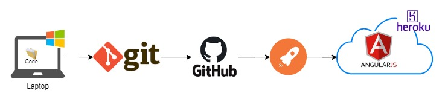

# Angular-TourOfHeroes-Front
Tour of Hero --- Angular + Node js

* [Angular Basic Tutorial](https://angular.io/tutorial) 


## App Deploy in Heroku

https://toh-front-app.herokuapp.com/

>The deploy is automatic from a pipeline.

### Flow of Deploy




## Initial Config

Clone and run `npm install` inside of angular project folder 

## Run project 

Run `npm start` command and navigate to `http://localhost:4200/`


## Bugs

In case of this error: 

```
Could not find module "@angular-devkit/build-angular" from "/home/Projects/myProjectName".
Error: Could not find module "@angular-devkit/build-angular" from "/home/Projects/myProjectName".
    at Object.resolve (/home/Projects/myProjectName/node_modules/@angular-devkit/core/node/resolve.js:141:11)
    at Observable.rxjs_1.Observable [as _subscribe] (/home/Projects/myProjectName/node_modules/@angular-devkit/architect/src/architect.js:132:40)
``` 

then execute the command `npm uninstall @angular-devkit/build-angular` Next, execute the command `npm install @angular-devkit/build-angular@0.13.0` for install the version corresponding.


